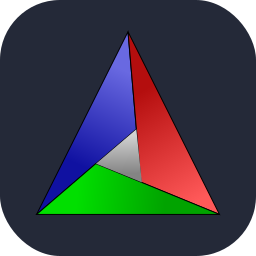

<h1>Know Me Better</h1>

Code-minded problem solver 
Curious about how things work under the hood 
blah blah blah 
If it works, I am as astonished as you are

 

<h2>Socials</h2>

 

<h1>Tech Stack</h1>

<b>Front End</b>

      

  

<b>Back End</b>

    

  

<b>Android Development</b>

  

  

<b>Database</b>

    

  

<b>Deployment</b>

  

  

<b>Other</b>

      

 

<h1>GitHub Stats</h1>

 

 

 

<!-- Proudly created with GPRM ( https://gprm.itsvg.in ) -->
